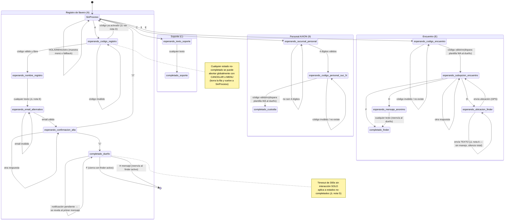

# Flujo de diálogos y estados — GFinder / VUELVE

Mapeo del código actual (`server.js`, commit `7bbcafb`) para revisar qué circuitos están completos y cuáles tienen huecos.

## Diagrama de estados

## Atajos globales (usuario con llavero `completado`)

| Disparador | Acción |
|---|---|
| `F` | Busca la fila `completado` más reciente con el mismo código y distinto teléfono (el "finder" u otra parte), la borra y avisa a ambos lados que se cerró el chat. |
| `H <mensaje>` | Igual búsqueda, pero reenvía el mensaje en vez de cerrar. |
| Cualquier texto, si hay `notificacion_pendiente` | Se revela el detalle real guardado (mensaje del finder o alerta) y se corta ahí — no sigue procesando el resto del texto como comando. |

## Circuitos incompletos / riesgos detectados

**A. `esperando_ubicacion_finder` no maneja mensajes de texto.**
Si el finder está en este estado y en vez de compartir ubicación escribe texto, ninguna rama del código lo atiende (solo se actualiza `ultima_interaccion`). El usuario queda "colgado" sin respuesta hasta que escriba `CANCELAR`/`MENU` o pase el timeout de 5 min. Debería reprompt-earlo pidiendo la ubicación de nuevo.

**B. Ambigüedad cuando hay más de una fila `completado` con el mismo `codigo_llavero`.**
El match de `F`/`H` del dueño busca "la fila `completado` más reciente con ese código y otro teléfono" — pero puede haber varias: el finder real, un empleado AXION que registró custodia (opción 9), o incluso un segundo finder que encontró el mismo código. Como se toma solo la más reciente por fecha, un evento posterior (ej. el empleado AXION cargando la custodia) puede "tapar" el vínculo con el finder real y el dueño termina hablando/cerrando con la fila equivocada.

**C. La fila de "custodia AXION" (opción 9) nunca se limpia.**
Queda como `completado` para siempre con el mismo código que el dueño, agravando el punto B indefinidamente (no hay ningún `F`/cierre que la borre).

**D. Al reingresar un código ya activado, no se reenvía el menú.**
El bot dice *"Código ya activado. Seleccioná la Opción C"* pero borra el proceso sin mostrar el menú — el usuario tiene que escribir `Hola` de nuevo para poder elegir C. Fricción evitable.

**E. Sin validación en `esperando_nombre_registro`.**
Acepta cualquier texto como nombre (vacío tras trim, solo números, emojis, etc.). Bajo impacto pero fácil de acotar con un largo mínimo.

**F. Filas `completado` "viejas" con el mismo código nunca se purgan solas.**
Si un llavero se reactiva o tiene varios ciclos de encuentro, las filas anteriores (finder, AXION) solo desaparecen si alguien hace `F` explícitamente. No hay barrido automático, a diferencia del timeout de 300s que sí limpia los procesos abandonados no completados.

**G. El timeout de 5 minutos no aplica a estados `completado`.**
Coherente para el dueño (su registro debe persistir), pero las filas de finder/AXION completadas (que en la práctica son "sesiones temporales" de un intercambio) tampoco expiran nunca — alimenta directamente los puntos B, C y F.

## Sugerencias de mejora (para priorizar, no implementadas)

1. Agregar manejo explícito de texto en `esperando_ubicacion_finder` (nota A) — bajo esfuerzo, cierra un hueco real de UX.
2. Distinguir el rol de cada fila `completado` con un campo explícito (`rol: dueño | finder | axion`) en vez de inferirlo por orden de fecha — resolvería B, C y F de raíz.
3. Reenviar el menú automáticamente cuando se cancela un registro por código duplicado (nota D).
4. Job periódico (similar al de notificaciones vencidas) que purgue filas `completado` de finder/AXION más allá de cierto tiempo sin actividad, en vez de depender de que alguien escriba `F`.
